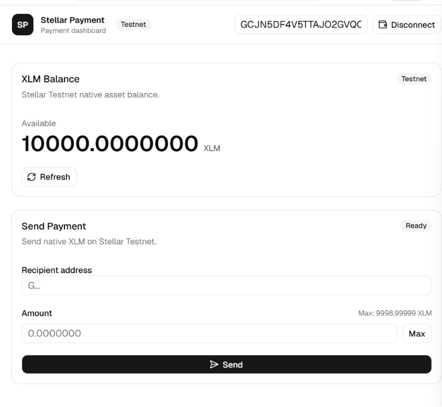
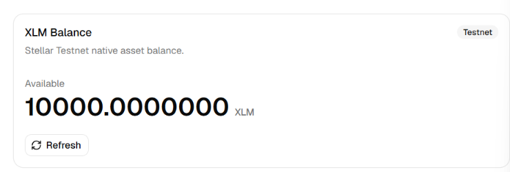
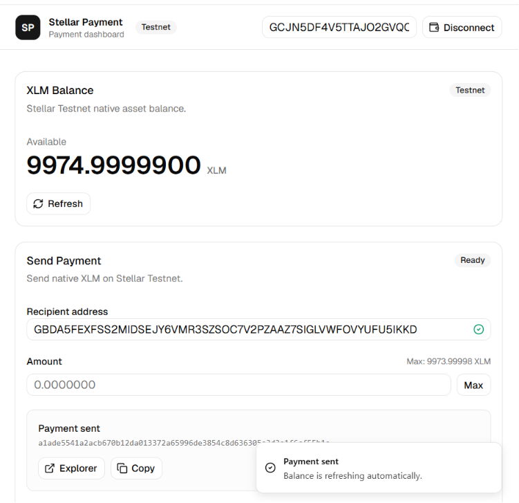
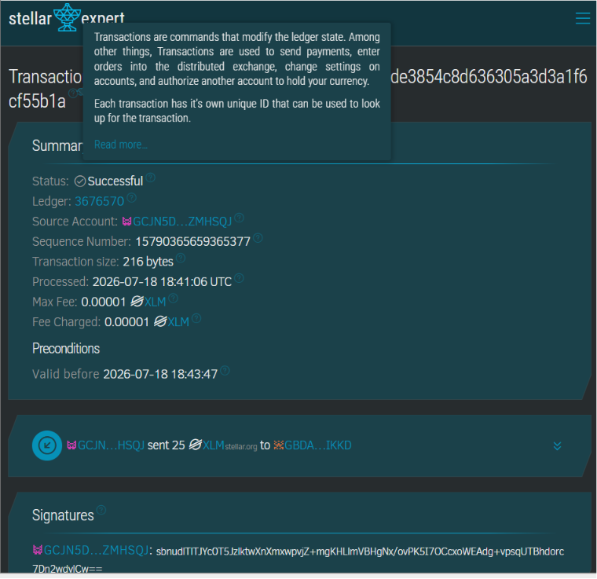
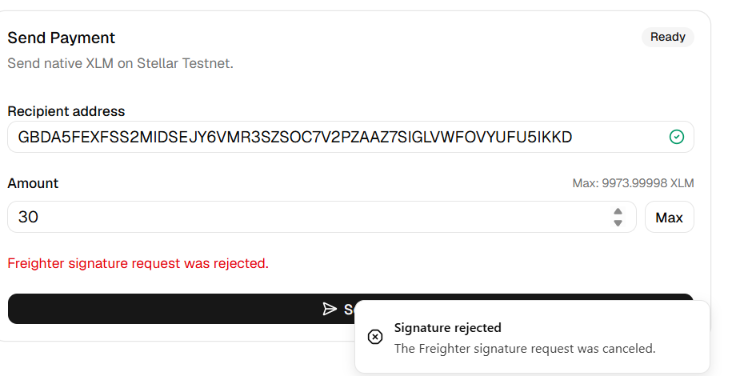

# Live Demo: [URL coming soon]

# Stellar Payment dApp

Stellar Payment dApp is a Simple Payment dApp for sending XLM on the Stellar Testnet with the Freighter wallet. It was built as a Stellar White Belt (Level 1) challenge project and focuses on the core wallet, balance, payment, and transaction feedback flow.

The app connects to Freighter, reads the user's Testnet XLM balance from Horizon, builds and signs payment transactions, submits them to the Stellar Testnet, and shows clear success or error feedback.

## Features

- Wallet connect and disconnect with Freighter
- Live native XLM balance from Stellar Testnet Horizon
- Send XLM payments with real-time recipient address and amount validation
- Transaction feedback with status updates, transaction hash, copy action, and Stellar Expert link
- Error handling for rejected signatures, insufficient balance, invalid addresses, and unfunded accounts

## Tech Stack

- React 18 + Vite
- Tailwind CSS
- shadcn/ui
- `@stellar/stellar-sdk`
- `@stellar/freighter-api`

## Setup

1. Clone the repository:

   ```bash
   git clone <repository-url>
   cd stellar-payment-app
   ```

2. Install dependencies:

   ```bash
   npm install
   ```

3. Start the development server:

   ```bash
   npm run dev
   ```

4. Open the local Vite URL shown in the terminal, usually:

   ```text
   http://localhost:5173
   ```

## Freighter Testnet Setup

1. Install Freighter from [freighter.app](https://freighter.app).
2. Create or import a wallet in Freighter.
3. Open Freighter settings and switch the network to **Testnet**.
4. Connect the wallet from the app.
5. If the account is not funded, copy your Testnet public key and fund it with Friendbot:

   ```text
   https://friendbot.stellar.org?addr=YOUR_TESTNET_ADDRESS
   ```

6. Refresh the balance in the app after Friendbot funds the account.

## Screenshots

| Screen | Preview |
| --- | --- |
| Wallet connected |  |
| Balance displayed |  |
| Transaction result shown to user |  |
| Successful testnet transaction on Stellar Expert |  |
| Error handling - rejected signature |  |
